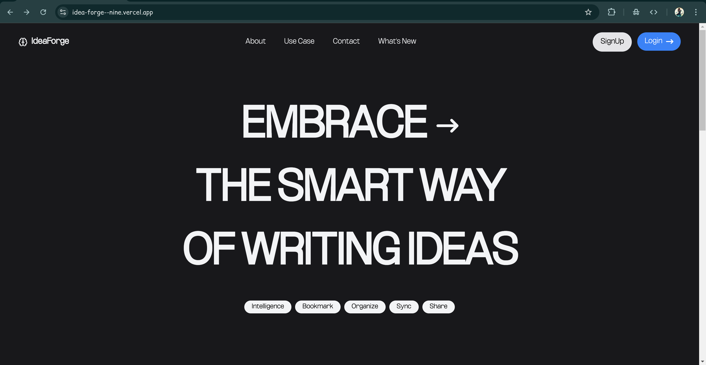
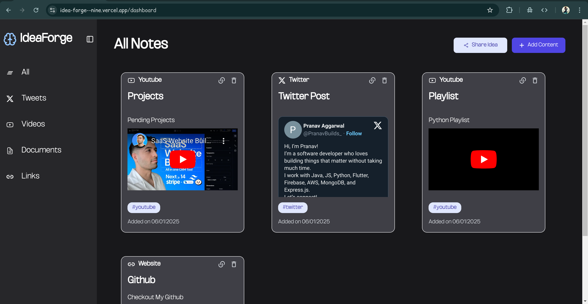
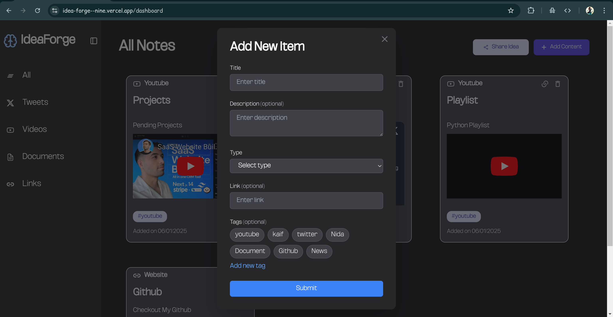

# 🚀 Idea Forge  

Idea Forge is a full-stack web application built with the MERN stack, designed to help users store, organize, and share their ideas seamlessly.  

## 🌟 Features  
- **User Authentication**:  
  - Secure sign-up and log-in system using **JWT (JSON Web Token)-based authentication**.  
  - **Password protection with Bcrypt** for hashing passwords.  
  - Zod Validation for reqs
  - Token-based authorization for accessing protected routes.  
- **Idea Cards**: Create cards to store ideas, links, documents, YouTube links, tweets, and more.  
- **Shareable Dashboards**: Share your idea dashboard with others without requiring them to sign up.  
- **Content Filtering**: Filter your content by category (videos, tweets, links, or documents) using a sidebar.  
- **Responsive Design**: Optimized for desktop and mobile devices.  

## 🛠️ Tech Stack  
- **Frontend**: React.js  
- **Backend**: Node.js, Express.js  
- **Database**: MongoDB  
- **Authentication**:  
  - **JWT** for secure token-based authentication.  
  - **Bcrypt** for password hashing.  
- **Deployment**: Render  & Vercel

## 📷 Screenshots  

## 📷 Deployment

The project is live at: https://idea-forge--nine.vercel.app/

# Dummy Credentials : 
email : admin123@gmail.com
password: 123456789
